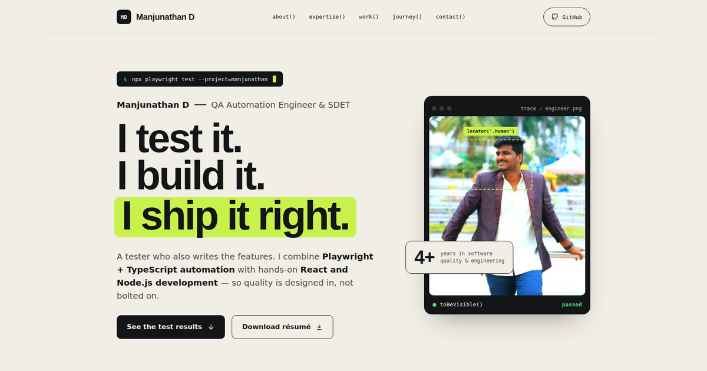

# Manjunathan D — QA Automation × Full-Stack Portfolio

Personal portfolio for **Manjunathan D**, QA Automation Engineer, SDET and Full-Stack Developer.
A static site (HTML + CSS + a little JavaScript) — no build step, ready for GitHub Pages.



## Folder structure

```
manjunathan-portfolio/
├── index.html          # All page content
├── style.css           # Design tokens, layout, responsive rules
├── script.js           # Mobile menu, active nav link, scroll reveal, footer year
├── README.md
├── assets/
│   ├── profile.png     # Portrait
│   ├── resume.pdf      # ← ADD YOUR RÉSUMÉ HERE (not included)
│   ├── favicon.svg
│   └── icons/          # Tool logos (Devicon / Iconify, MIT-licensed)
└── screenshots/
    └── preview.png     # Used in this README and for social sharing (og:image)
```

## Before you publish

1. **Add your résumé** as `assets/resume.pdf`. The "Download résumé" button in the hero links to it.
2. **Project links** — all three "Selected work" rows currently point to your GitHub profile.
   Replace each `href="https://github.com/manjunathan5838"` inside `.work__list` in `index.html`
   with the matching repository URL.
3. *(Optional)* Replace `assets/profile.png` with a larger photo (800×800 or more) for sharper
   display on high-resolution screens. Keep the same file name.

## Publish on GitHub Pages

1. Create a public repository named **`manjunathan5838.github.io`**.
2. Upload everything inside this folder to the repository root (keep the `assets/` and `screenshots/` folders).
3. Go to **Settings → Pages → Build and deployment → Deploy from a branch → `main` → `/ (root)`** and save.
4. The site will be live at **https://manjunathan5838.github.io/** in a minute or two.

> If you use a different repository name, update the `canonical`, `og:url`, `og:image` and JSON-LD URLs at the top of `index.html`.

## Customising

- **Accent colour** — change `--accent` at the top of `style.css` (e.g. `#FF8A5B`, `#7DD3FC`, `#FACC15`).
- **Fonts** — Bricolage Grotesque (headings), IBM Plex Sans (body), IBM Plex Mono (labels), loaded from Google Fonts.
- **SEO** — the page includes a meta description, Open Graph tags and `Person` structured data (JSON-LD).

## Privacy

This portfolio intentionally uses only generalized project descriptions. Do not publish company source code,
credentials, internal APIs, private test data, healthcare/patient information, or internal project names.
